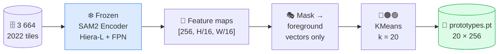
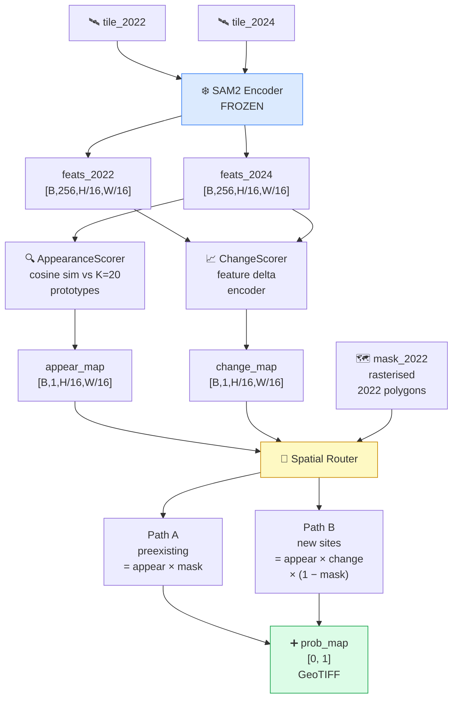
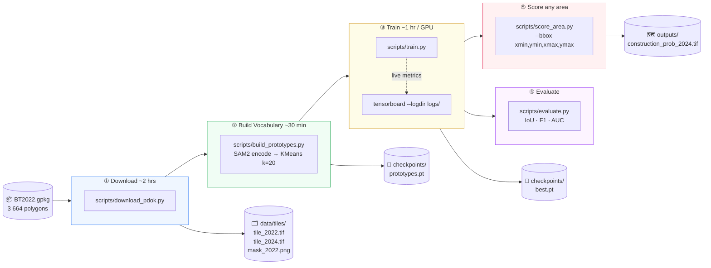

<div align="center">

# 🕵️ SamSpade

### *SAM2 meets a shovel. Construction sites don't stand a chance.*

**Zero-shot aerial construction site detection · Netherlands · No 2024 labels needed**

[](https://python.org)
[](https://pytorch.org)
[](https://github.com/facebookresearch/sam2)
[](https://huggingface.co/openai/clip-vit-large-patch14)
[](https://service.pdok.nl)
[](LICENSE)

</div>

---

## What is this?

The Dutch government keeps a database of ~3 700 active construction sites from its 2022 land-use survey. **SamSpade** answers two questions from the sky, without any 2024 labels:

| Question | What we look for |
|---|---|
| 🔄 **Still under construction?** | Was a site in 2022, *still looks like construction* in 2024 |
| 🆕 **New site appeared?** | Wasn't construction in 2022, *now looks like construction* in 2024 |

Imagery comes from [PDOK](https://service.pdok.nl/hwh/luchtfotorgb/wms/v1_0) — the Netherlands' free 8 cm orthophoto service.

---

## Interactive Dashboard

SamSpade ships a **FastAPI + Leaflet.js** dashboard that runs locally and gives you four analysis modes over live PDOK imagery.

### Dashboard Modes

| Mode | Description |
|---|---|
| 📐 **Auto Segment** | SAM2 auto-segments the area → CLIP classifies each segment (14 aerial labels) → colorful map with construction highlighted |
| 🔥 **Change Detect** | Fetches 2022 + 2024 tiles → SAM2 prototype matching + CLIP spatial scoring + Depth variance + NDVI → heatmap + preexisting/new polygons |
| ✏ **Text SAM** | Grounding DINO finds objects by text prompt → SAM2 refines precise masks → prototype-scored results |
| 🎯 **One-Shot** | Draw a reference example → SAM2+CLIP encode it → draw a search area → find visually similar patches anywhere |

### Running the Dashboard

#### Prerequisites

```bash
# Create and activate the environment
conda create -n construction python=3.11
conda activate construction

pip install -r requirements.txt
pip install sam2                # Facebook SAM2
pip install segment-geospatial  # samgeo vectorization pipeline
```

#### First-time setup: build prototype vocabulary

```bash
# Download tile pairs for all 2022 construction polygons (~2 hrs)
python scripts/download_pdok.py \
    --polygons data/raw/BT2022.gpkg \
    --years 2022 2024 \
    --resolution 8cm \
    --out data/tiles/

# Build the K=20 prototype vocabulary (~30 min on GPU)
python scripts/build_prototypes.py \
    --tiles  data/tiles/ \
    --k      20 \
    --out    checkpoints/prototypes.pt
```

#### Start the dashboard

```bash
# Using the construction conda environment
C:\Users\<you>\miniconda3\envs\construction\python.exe -m uvicorn dashboard.app:app --host 0.0.0.0 --port 8000

# Or on Linux/Mac
python -m uvicorn dashboard.app:app --host 0.0.0.0 --port 8000
```

Open **http://localhost:8000** in your browser.

> **First load:** models take ~60–90 s to load (SAM2 Hiera-L + Grounding DINO + CLIP ViT-L/14 + Depth Anything V2). The status bar shows `Models ready · cuda` when done.

#### Dashboard UI

```
┌─────────────────────────────────────────────────────────────────┐
│  MAP (Leaflet)                          │  SIDEBAR              │
│                                         │  ┌─ Aerial Imagery ─┐ │
│  PDOK 2022 / 2024 orthophoto basemap    │  │ 2022 | 2024 | Topo│ │
│  (toggle years, blend slider)           │  │ blend slider      │ │
│                                         │  └───────────────────┘ │
│  📡 2024  ← year badge                 │  ┌─ Detection Mode ──┐ │
│                                         │  │📐 🔥 ✏ 🎯        │ │
│  Results overlaid as:                   │  │ Draw Area button  │ │
│  • Colored SAM segments (Auto Seg)      │  └───────────────────┘ │
│  • Red/orange heatmap (Change Detect)   │  ┌─ Results ─────────┐ │
│  • Purple patches (One-Shot)            │  │ Stats + labels    │ │
│                                         │  │ ⬇ Download GPKG   │ │
│  Legend (bottom-right): CLIP labels     │  └───────────────────┘ │
└─────────────────────────────────────────────────────────────────┘
```

#### Using One-Shot mode

1. Switch to **🎯 One-Shot** tab
2. Click **Draw Reference Area** → draw a small box around one known construction site
3. The server SAM2-encodes the tile → thumbnail appears in the sidebar
4. Click **Draw Search Area** → draw a larger area to search
5. A similarity heatmap appears showing all visually similar patches

#### Downloading results

Every analysis saves a **GeoPackage** to `outputs/`. Click **⬇ Download GeoPackage** in the sidebar, or:

```bash
curl http://localhost:8000/api/download/results.gpkg -o results.gpkg
```

Load in QGIS: `Layer → Add Vector Layer → results.gpkg`

---

## How It Works

### Step 1 — Build a Visual Vocabulary of Construction



The 20 cluster centroids capture the **full visual vocabulary** of Dutch construction sites — bare earth, scaffolding, rebar, wet concrete, cranes, and more. All without a single 2024 label.

---

### Step 2 — Score New Imagery

The Change Detect mode blends four signals:

```
appearance = 0.40 × SAM2_prototype_score
           + 0.40 × CLIP_spatial_score        (4×4 grid vs 14 aerial labels)
           + 0.10 × depth_variance_signal     (Depth Anything V2 — uneven terrain)
           + 0.10 × NDVI_bare_soil_signal     (PDOK CIR bands — low NDVI = construction)

preexisting = appearance × mask_2022
new_sites   = appearance × change_score × (1 − mask_2022)
output      = preexisting + new_sites
```



---

### Step 3 — The Routing Logic

The 2022 land-use mask acts as a **hard spatial router**. Each pixel goes through exactly one path:

```
╔══════════════════════════════════════════════════════════════════╗
║  Was this pixel construction in 2022?                            ║
╠══════════════════════════════════════╦═══════════════════════════╣
║  YES  →  PATH A (Preexisting)        ║  NO  →  PATH B (New)      ║
║                                      ║                           ║
║  score = appearance_2024             ║  score = appearance_2024  ║
║                                      ║        × change_score     ║
║  ✅ still looks like construction?   ║                           ║
║     → flag it                        ║  ✅ looks like constr.    ║
║  ✅ now looks like a building?       ║     AND changed?          ║
║     → suppress (completed!)          ║     → flag it             ║
║                                      ║  ✅ stable field/road?    ║
║  ⚠️  change signal NOT used here    ║     → suppress            ║
║     (it would be LOW for ongoing     ║                           ║
║      sites = false negatives)        ║                           ║
╚══════════════════════════════════════╩═══════════════════════════╝

combined = PATH A + PATH B    ← spatially disjoint, no pixel counted twice
```

---

## Pipeline (training / offline)



---

## CLI: Score Any Area

```bash
python scripts/score_area.py \
    --bbox        100000,450000,150000,500000 \
    --prototypes  checkpoints/prototypes.pt \
    --checkpoint  checkpoints/best.pt \
    --mask2022    data/raw/BT2022.gpkg \
    --out         outputs/construction_prob_2024.tif \
    --out-gpkg    outputs/construction_sites_2024.gpkg \
    --threshold   0.5
```

| Output | Format | Contents |
|---|---|---|
| `construction_prob_2024.tif` | Float32 GeoTIFF · 3 bands | Band 1: combined · Band 2: preexisting · Band 3: new |
| `construction_sites_2024.gpkg` | GeoPackage · vector polygons | `type`, `prob_combined`, `prob_preexisting`, `prob_new`, `area_m2` |

Both are in **EPSG:28992** and load directly into QGIS, ArcGIS, or any GIS tool.

---

## Models Loaded at Runtime

| Model | Role | Params |
|---|---|---|
| SAM2 Hiera-L + FPN | Image encoder — frozen feature extractor | ~300 M ❄️ |
| AppearanceScorer | Cosine sim vs K=20 prototypes | ~2 M ✅ |
| ChangeScorer | Feature delta encoder | ~2 M ✅ |
| Grounding DINO base | Text → bounding boxes (Text SAM mode) | ~172 M |
| CLIP ViT-L/14 | Per-segment semantic classification | ~430 M |
| Depth Anything V2 Small | Depth map → terrain variance signal | ~25 M |

All six models share a single GPU (CUDA). Total VRAM: ~8–10 GB with CLIP + SAM2 + DINO.

---

## Data & Sources

| | Source | Detail |
|---|---|---|
| 🛰️ **RGB Imagery** | [PDOK Luchtfoto WMS](https://service.pdok.nl/hwh/luchtfotorgb/wms/v1_0) | 8 cm orthoHR, layers `2022_orthoHR` / `2024_orthoHR` |
| 🌿 **CIR Imagery** | [PDOK CIR WMS](https://service.pdok.nl/hwh/luchtfotocir/wms/v1_0) | Color-infrared for NDVI, `{year}_ortho25` |
| 🗺️ **Polygons** | BT2022.gpkg | 3 664 construction sites, Dutch land-use survey, EPSG:28992 |

<details>
<summary>🔧 PDOK WMS gotchas (learned the hard way)</summary>

| Gotcha | What happens | Fix |
|---|---|---|
| `TIME` parameter | Silently ignored — returns current year | Use year-specific layer names: `2022_orthoHR` |
| Small bbox | Returns pure white image | Enforce **600 m minimum** extent centred on polygon |
| `2021_ortho25` | Layer does not exist | Skip 2021; use 2020 or 2022 instead |
| `owslib.getmap` | Inconsistent behaviour | Use `requests.Session` directly |
| 8 cm blank tile | Some areas only have 25 cm coverage | Auto-fallback: try 8 cm → fall back to 25 cm |

</details>

---

## Project Structure

```
SamSpade/
├── 📁 configs/
│   ├── base.yaml              # Shared hyperparameters
│   ├── train.yaml             # Training overrides
│   └── inference.yaml         # Inference overrides
├── 📁 dashboard/
│   ├── app.py                 # FastAPI backend (all models + endpoints)
│   └── static/index.html      # Leaflet.js frontend (4 detection modes)
├── 📁 data/
│   ├── pdok_downloader.py     # PDOK WMS client (RGB + CIR)
│   ├── dataset.py             # ConstructionChangeDataset
│   └── transforms.py          # Augmentation pipeline
├── 📁 models/
│   ├── detector.py            # ConstructionChangeDetector (top-level)
│   ├── appearance_scorer.py   # Cosine sim vs corpus prototypes
│   ├── change_scorer.py       # Feature delta encoder
│   ├── corpus_prototype.py    # KMeans prototype builder
│   └── feature_utils.py       # Tiling, stitching, GeoTIFF I/O
├── 📁 losses/
│   └── segmentation_losses.py # BCE + Dice
├── 📁 training/
│   └── trainer.py             # Training loop · AMP · checkpointing
├── 📁 evaluation/
│   └── metrics.py             # IoU · F1 · AUC
└── 📁 scripts/
    ├── download_pdok.py        # ① tile downloader
    ├── build_prototypes.py     # ② vocabulary builder
    ├── train.py                # ③ model training
    ├── evaluate.py             # ④ metrics
    └── score_area.py           # ⑤ GeoTIFF output
```

---

## Requirements

- Python 3.11+
- PyTorch ≥ 2.3 with CUDA (SAM2 Hiera-L requires ~6 GB VRAM minimum)
- ~50 GB disk for all tile pairs at 8 cm orthoHR
- CUDA GPU strongly recommended (CPU inference is very slow)

---

<div align="center">

*Named after Sam Spade — the detective who always finds what's hidden.*
*Powered by SAM2 — the model that segments anything.*
*Built for the Netherlands — where everything is always under construction.*

</div>
